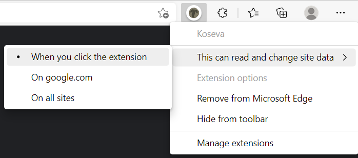

# Koseva

A browser extension that changes text in Hebrew script to Paleo-Hebrew script.


<blockquote dir="rtl">
ביהודה למשל נעשה בו [הכתב העברי הקדום] שימוש במטבעות שנטבעו על ידי המלכים החשמונאיים [..] וכך גם במטבעות שטבעו היהודים בזמן מרד בר כוכבא (132–135). חוקרים משערים, כי הסיבה לשימוש בכתב זה בימים אלו, אף על פי שלא היה בשימוש היומיומי, נובעת מהרצון להזכיר את ימי הפריחה הכלכלית והמדינית בתקופת הזוהר שהמקרא מייחס לתקופת דוד ושלמה, שאז השימוש בכתב זה היה נפוץ.

― [הכתב העברי הקדום - ויקיפדיה](https://he.wikipedia.org/wiki/%D7%94%D7%9B%D7%AA%D7%91_%D7%94%D7%A2%D7%91%D7%A8%D7%99_%D7%94%D7%A7%D7%93%D7%95%D7%9D#:~:text=%D7%91%D7%99%D7%94%D7%95%D7%93%D7%94%20%D7%9C%D7%9E%D7%A9%D7%9C%20%D7%A0%D7%A2%D7%A9%D7%94,%D7%96%D7%94%20%D7%94%D7%99%D7%94%20%D7%A0%D7%A4%D7%95%D7%A5.)
</blockquote>


## Installation

```shell
npm i && npm run build
```

And load the extension that will wait for you at `/dist` normally, according to your browser <sup>[\[Chrome\]](https://developer.chrome.com/docs/extensions/mv3/getstarted/#:~:text=Open%20the%20Extension,the%20extension%20directory.)</sup><sup>[\[Firefox\]](https://developer.mozilla.org/en-US/docs/Mozilla/Add-ons/WebExtensions/Your_first_WebExtension#installing)</sup><sup>[\[Edge\]](https://docs.microsoft.com/en-us/microsoft-edge/extensions-chromium/getting-started/extension-sideloading)</sup>.

## Usage

Once installed, the extension always runs, as long as it's permitted to.

This is not recommended as it can get intrusive on performance and also break some sites (but feel free to experiment). It's generally better to only allow the extension to run on-demand.
E.g. in Microsoft Edge this is done by right-click on its symbol in the toolbar and select "This can read and change site data" → "When you click the extension".

<p align="center">
	
</p>
