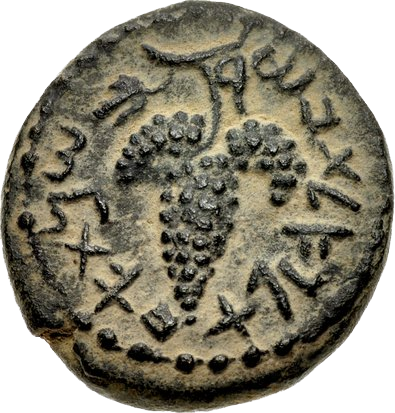

# Koseva

A browser extension that changes text in Hebrew script to Paleo-Hebrew script.


<blockquote dir="rtl">
ביהודה למשל נעשה בו [הכתב העברי הקדום] שימוש במטבעות שנטבעו על ידי המלכים החשמונאיים [..] וכך גם במטבעות שטבעו היהודים בזמן מרד בר כוכבא (132–135). חוקרים משערים, כי הסיבה לשימוש בכתב זה בימים אלו, אף על פי שלא היה בשימוש היומיומי, נובעת מהרצון להזכיר את ימי הפריחה הכלכלית והמדינית בתקופת הזוהר שהמקרא מייחס לתקופת דוד ושלמה, שאז השימוש בכתב זה היה נפוץ.

― [הכתב העברי הקדום - ויקיפדיה](https://he.wikipedia.org/wiki/%D7%94%D7%9B%D7%AA%D7%91_%D7%94%D7%A2%D7%91%D7%A8%D7%99_%D7%94%D7%A7%D7%93%D7%95%D7%9D#:~:text=%D7%91%D7%99%D7%94%D7%95%D7%93%D7%94%20%D7%9C%D7%9E%D7%A9%D7%9C%20%D7%A0%D7%A2%D7%A9%D7%94,%D7%96%D7%94%20%D7%94%D7%99%D7%94%20%D7%A0%D7%A4%D7%95%D7%A5.)

</blockquote>

## Installation

### Browser Extension Repositories

<p align=center>
  <a href="https://chrome.google.com/webstore/detail/cfmmdplbmnmbjdjjbnihnjldbckgeekc">
    
    
  </a>
  <a href="https://addons.mozilla.org/firefox/addon/koseva">
    
  </a>
</p>

### Manual Installation

Download the latest [release](https://github.com/yehuthi/koseva/releases), extract the archive to a folder where you will keep it, and load it according to your browser <sup>[\[Chrome\]](https://developer.chrome.com/docs/extensions/mv3/getstarted/#:~:text=Open%20the%20Extension,the%20extension%20directory.)</sup><sup>[\[Firefox\]](https://developer.mozilla.org/en-US/docs/Mozilla/Add-ons/WebExtensions/Your_first_WebExtension#installing)</sup><sup>[\[Edge\]](https://docs.microsoft.com/en-us/microsoft-edge/extensions-chromium/getting-started/extension-sideloading)</sup>.

To build from source clone and run:

```shell
npm i && npm run build
```

Then load the extension that will wait for you at `/dist` normally.

## Usage

- Click the extension icon when you want it to run.
- Refresh the page to remove its effects.

## Build

- Clone this repository
- `npm i`
- `npm run build`
- Navigate to the new "dist" sub-directory.
- A manifest-version 3 build for Chrome and Edge will be in `v3`.
- A manifest-version 2 build for Firefox will be in `v2-gecko`.
